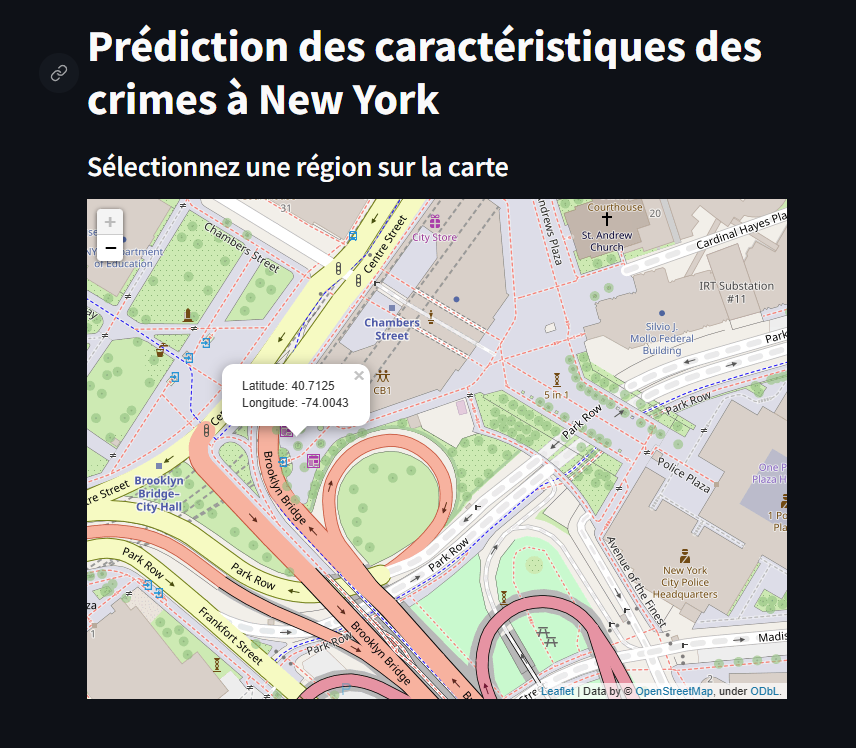
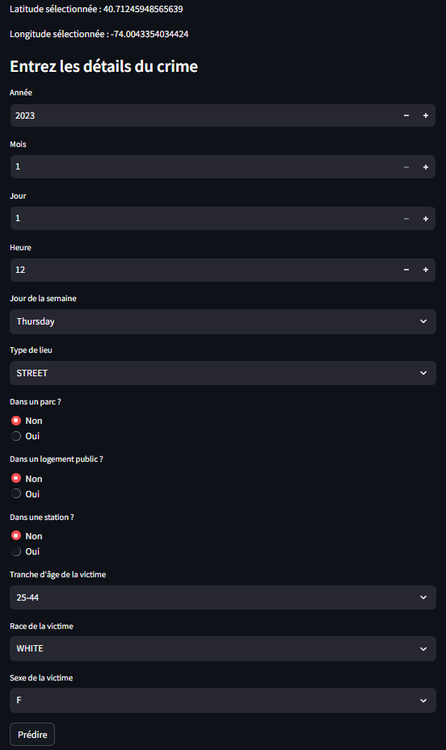
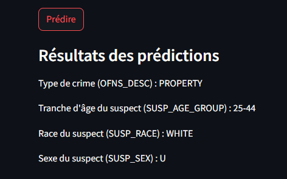

# 🗽 Crime Prediction in New York City 🚔

This project is an interactive web application designed to predict crime characteristics in New York City. By leveraging machine learning models, the app provides insights into potential crime types and suspect demographics based on user inputs.

---

## 📚 Table of Contents

1. [📖 Project Overview](#-project-overview)
2. [✨ Features](#-features)
3. [🧠 Models](#-models)
4. [💻 Application](#-application)
5. [📸 Screenshots](#-screenshots)
6. [⚙️ Setup and Installation](#️-setup-and-installation)
7. [🚀 Usage](#-usage)
8. [📊 Results and Insights](#-results-and-insights)
9. [📜 License](#-license)

---

## 📖 Project Overview

The purpose of this project is to provide a tool for crime analysis by predicting key attributes:
- **Type of Crime** (e.g., property, assault),
- **Suspect's Age Group**,
- **Suspect's Race**,
- **Suspect's Gender**.

The project includes two main components:
1. Comparative analysis of machine learning models: **Random Forest** and **XGBoost**.
2. A **Streamlit-based application** for real-time predictions.

---

## ✨ Features

- **Machine Learning Models**:
  - Random Forest and XGBoost for multi-output classification.
  - Performance comparison for accuracy, recall, and F1 scores.

- **Interactive Application**:
  - 🗺️ Map-based region selection using **Folium**.
  - 📝 Input form for crime details.
  - ⚡ Real-time predictions with decoded outputs.

---

## 🧠 Models

### 1. Random Forest 🌲
- **Average Accuracy**: 87.5%
- **Average Recall**: 86.0%
- **Average F1 Score**: 86.8%

### 2. XGBoost 🚀
- **Average Accuracy**: 82.3%
- **Average Recall**: 80.5%
- **Average F1 Score**: 81.4%

| Metric               | 🌲 Random Forest | 🚀 XGBoost  |
|-----------------------|------------------|-------------|
| Average Accuracy (%) | 87.5             | 82.3        |
| Average Recall (%)    | 86.0             | 80.5        |
| Average F1 Score (%)  | 86.8             | 81.4        |
| Training Time (s)     | 15               | 12          |

✨ **Conclusion**: Random Forest outperformed XGBoost in all metrics and was selected for integration into the application.

---

## 💻 Application

The application is built with **Streamlit** to provide an intuitive user interface. Key functionalities include:
1. 🗺️ **Map Interaction**: Users can select a region in New York City using an interactive map.
2. 📝 **User Inputs**: Fields for specifying details such as date, time, location, and victim characteristics.
3. ⚡ **Prediction Results**: Real-time predictions displayed in human-readable format.

---

## 📸 Screenshots

### 1. Region Selection on Map 🗺️


### 2. Input Form for Crime Details 📝


### 3. Prediction Results ⚡


---

## ⚙️ Setup and Installation

### Prerequisites
- Python 3.8 or higher
- Required libraries:
  - `pandas`
  - `scikit-learn`
  - `xgboost`
  - `streamlit`
  - `folium`
  - `streamlit-folium`

### Installation Steps
1. Clone the repository:
   ```bash
   git clone https://github.com/trabelsiaya/Crime_Prediction_in_New_York_City.git
### Paper
To document our work, we wrote a research [paper](paper.pdf) that is included in the repo.

